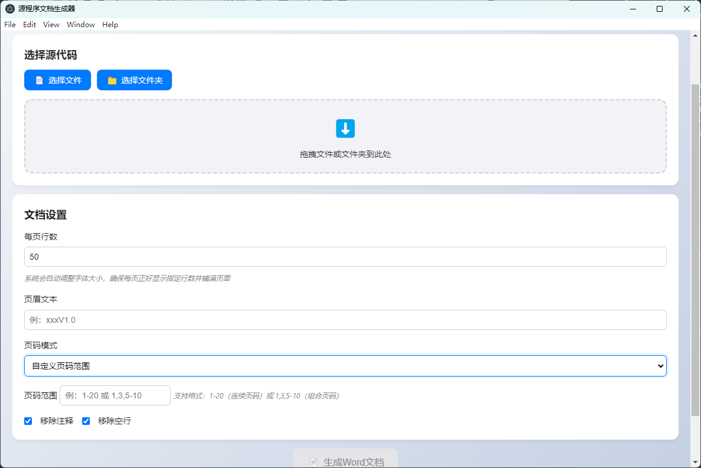
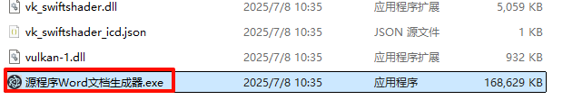

# 📄 源程序文档生成软件

<div align="center">


**专为软件著作权申请设计的源代码文档自动生成工具**

[功能特点](#-功能特点) • [快速开始](#-快速开始) • [使用指南](#-使用指南) • [开发文档](#-开发文档)

</div>

---

## 🎯 项目简介

源程序文档生成软件是一个专业的源代码文档生成工具，专为软件著作权申请而设计。它能够将源代码文件自动转换为符合软件著作权申请要求的 Word 文档格式，大大简化了文档准备工作。


## ✨ 功能特点

### 📋 核心功能

- **智能分页**：自动按页数要求分页，支持全页面或自定义页码范围
- **格式优化**：自动调整字体大小、行间距以适配页面要求
- **页眉定制**：支持自定义页眉内容，符合申请规范
- **批量处理**：支持单文件和文件夹批量处理
- **拖拽操作**：图形界面支持拖拽文件/文件夹操作

### 🖥️ 界面选择

- **图形界面（GUI）**：基于 Electron 的现代化界面，操作直观

### 📄 输出格式

- **Word 文档**：生成标准的。docx 格式文档
- **页码控制**：智能页码模式，优化大文件处理
- **内容结构**：保持源代码原有结构和格式

## 🚀 快速开始

### 📋 环境要求

- **操作系统**：Windows

### 📦 安装步骤

去发行版下载安装包，免安装的，解压压缩包，点击直接运行



### 🎯 快速体验

**使用图形界面：**

1. 双击源程序 Word 文档生成器
2. 点击"选择文件"或"选择文件夹"
3. 配置文档设置（可选）
4. 点击"生成文档"

## 📖 使用指南

### 🖥️ 图形界面使用

#### 文件选择

- **选择文件**：选择单个源代码文件
- **选择文件夹**：批量处理整个文件夹
- **拖拽操作**：直接拖拽文件或文件夹到界面

#### 文档设置

- **每页行数**：设置每页显示的代码行数（默认：50 行）
- **页眉文本**：自定义页眉内容（默认：''）
- **页码模式**：

  - `全部页面`：生成所有页面
  - `自定义页码范围`：可以自己按需求，选择对应的页面

## 🏗️ 项目结构

```
源程序文档生成软件/
├── 📁 src/                    # 源代码目录
│   ├── 📁 main/               # 主进程模块
│   │   ├── 📄 codeParser.js      # 代码解析器
│   │   ├── 📄 documentGenerator.js # 文档生成器
│   │   └── 📄 fileHandler.js     # 文件处理器
│   └── 📁 renderer/           # 渲染进程模块
│       ├── 📄 index.html         # 主界面
│       ├── 📄 main.js           # 界面逻辑
│       └── 📄 style.css         # 样式文件
├── 📄 main.js                 # Electron 主进程入口
├── 📄 cli.js                  # 命令行入口
├── 📄 preload.js              # 预加载脚本
├── 📄 package.json            # 项目配置
└── 📄 README.md               # 项目说明
```

## 🔧 开发文档

### 📚 核心模块说明

#### 🔍 codeParser.js

负责解析源代码文件，提取代码内容并进行预处理。

#### 📝 documentGenerator.js

核心文档生成模块，使用 docx 库生成 Word 文档，处理分页、格式化等功能。

#### 📂 fileHandler.js

文件操作模块，处理文件读取、路径解析等操作。

### 📋 使用问题

**Q: 支持哪些编程语言的源代码？**
A: 支持所有文本格式的源代码文件，包括但不限于：

- JavaScript (.js, .ts, .jsx, .tsx)
- Python (.py)
- Java (.java)
- C/C++ (.c, .cpp, .h)
- C# (.cs)
- PHP (.php)
- 其他文本格式文件

**Q: 如何处理大型项目？**
A: 建议：

- 使用"自定义页码范围"模式处理大文件
- 分批处理多个文件
- 选择核心源代码文件进行处理

**Q: 生成的文档可以直接用于软件著作权申请吗？**
A: 本工具生成的文档格式符合一般要求，但建议：

- 根据具体申请机构要求进行微调
- 检查页眉页脚信息是否正确
- 确认页码和格式符合要求

## 📄 许可证

本项目采用 MIT 许可证 - 查看 [LICENSE](LICENSE) 文件了解详情。

**本项目基于以下项目修改而来，做了一些定制化改造**

[LeastBit/SourceCodeDoc: 专为软件著作权申请设计的源代码自动转 Word 文档工具，支持智能分页、格式优化、批量处理，提供 GUI 与 CLI 两种操作方式，输出标准 docx 格式，适配多种编程语言。](https://github.com/LeastBit/SourceCodeDoc)
